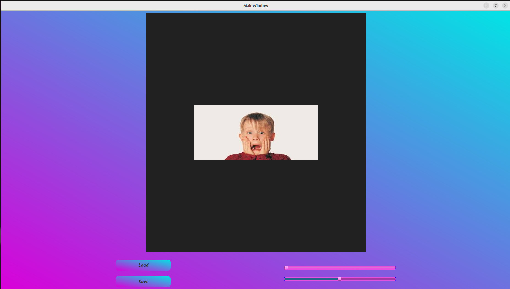
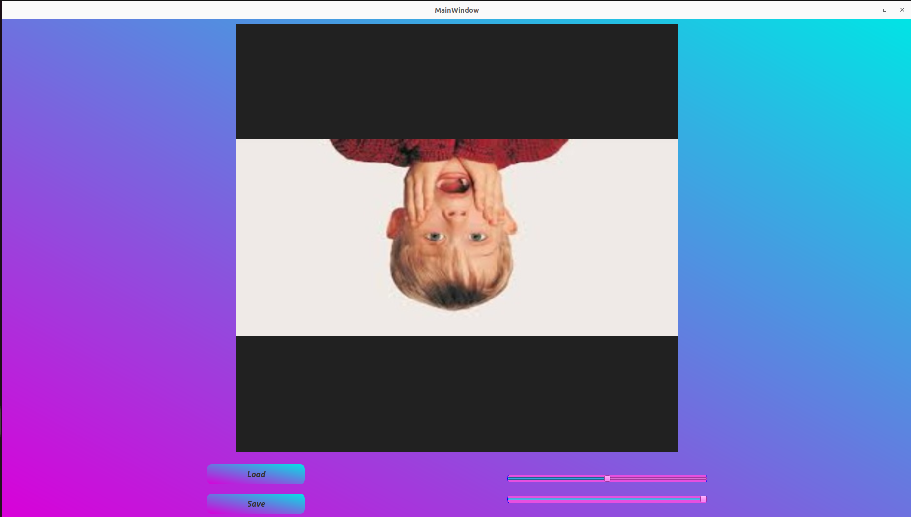

# Image Transformation GUI Application


## Table of Contents
- [Description](#description)
- [Features](#features)
- [Prerequisites](#prerequisites)
- [Getting Started](#getting-started)
- [Usage](#usage)
- [Screenshots](#screenshots)

## Description

The Image Transformation GUI Application is a C++ program developed using the Qt framework. It provides a user-friendly graphical user interface for performing various transformations on images. This application supports image scaling, rotation.

## Features

- User-friendly GUI for image scaling and rotation.
- Supports loading images in various formats (e.g., JPEG, PNG).
- Easy-to-use controls for adjusting transformation parameters.
- Save the transformed image in different formats.

## Prerequisites

Before you can use this application, ensure that you have the following prerequisites installed:

- Qt Creator (download and install from [Qt's official website](https://www.qt.io/download))
- CMake (for building the project)
- C++ compiler (e.g., GCC, Clang)

## Getting Started

1. Clone the repository:

   ```shell
   git clone https://github.com/Kalashyan-1/Image-Transformation.git

2. Open Qt Creator.

3. Click on "Open Project" and navigate to the `Image-Transformation-qt` directory.

4. Select the CMakeLists.txt file and open it.

5. Qt Creator will configure the project.


## Usage

1. In Qt Creator, locate the project file in the "Projects" tab on the left sidebar.

2. Right-click on the project and select "Build" to compile the image transformation application.

3. Once the build is successful, you can click the "Run" button to launch the application.

4. Use the application to open an image you want to transform.

5. Adjust the scaling and rotation needed.

6. You can also choose to save the transformed image in different formats.

## Contributing

If you'd like to contribute to this project, please follow these steps:

1. Fork the repository.

2. Create a new branch for your feature or bug fix.

3. Make your changes and test them thoroughly.

4. Create a pull request with a clear description of your changes.


## Screenshots





